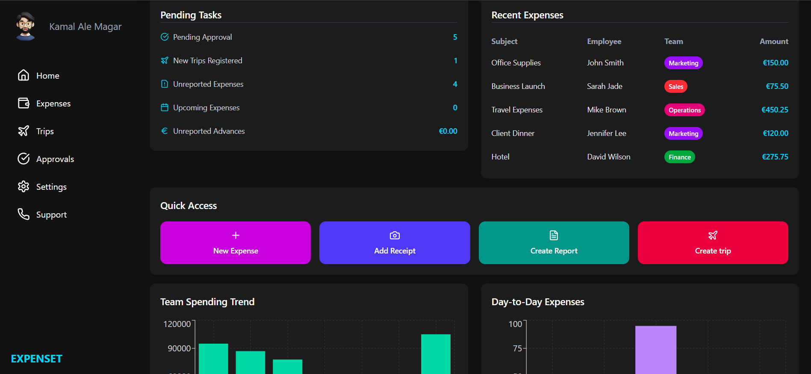

# 💸 Expense Tracker Dashboard

A sleek and modern expense tracking dashboard built with **React** and **Tailwind CSS**. This app visualizes tasks, team expenses, quick actions, and monthly reports using charts — ideal for internal financial teams or personal budgeting tools.

---

## 🚀 Features

- Sidebar navigation with icons
- Summary of pending tasks and recent expenses
- Quick action buttons for fast operations
- Monthly report with data visualizations (Recharts)
- Fully responsive and dark theme UI

---

## 🛠️ Tech Stack

- **React.js**
- **Tailwind CSS**
- **Recharts** (for data visualization)

---

